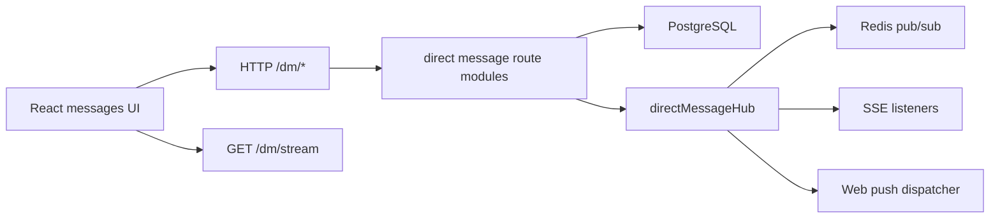
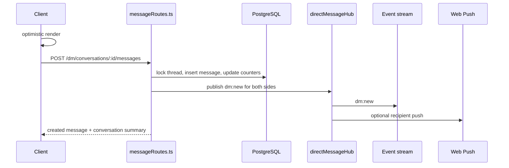

# Direct Messaging

This document describes how direct messaging currently works in the codebase. It documents the implemented system, not a future target architecture.

## Scope

- backend data model
- route structure and request flow
- SSE realtime delivery
- Redis pub/sub fan-out
- unread, delivered, and seen semantics
- frontend state flow
- media attachments
- push notifications
- current limitations

## Summary

The current DM system:

- supports one-to-one conversations only
- supports text, images, GIFs, and videos
- assigns a thread-local monotonically increasing `sequence`
- uses optimistic send with idempotent retries
- streams realtime updates over SSE
- uses Redis pub/sub to broadcast across processes
- stores unread and receipt state as thread-level cursors instead of per-message rows

The current DM system does not support:

- group chats
- message editing
- message deletion
- reactions
- message replies
- forwarding
- online presence
- archive, mute, or pin

## Source Map

Main files:

- `/Users/k/Desktop/social/src/routes/directMessages.ts`
- `/Users/k/Desktop/social/src/routes/directMessages/connectionRoutes.ts`
- `/Users/k/Desktop/social/src/routes/directMessages/conversationRoutes.ts`
- `/Users/k/Desktop/social/src/routes/directMessages/messageRoutes.ts`
- `/Users/k/Desktop/social/src/routes/directMessages/queries.ts`
- `/Users/k/Desktop/social/src/routes/directMessages/helpers.ts`
- `/Users/k/Desktop/social/src/routes/directMessages/schemas.ts`
- `/Users/k/Desktop/social/src/routes/directMessages/types.ts`
- `/Users/k/Desktop/social/src/services/directMessageHub.ts`
- `/Users/k/Desktop/social/src/services/webPush.ts`
- `/Users/k/Desktop/social/lincol-app/src/pages/Messages.tsx`
- `/Users/k/Desktop/social/lincol-app/src/features/messages/useMessagesController.ts`
- `/Users/k/Desktop/social/lincol-app/src/store/dmStore.ts`

Related migrations:

- `/Users/k/Desktop/social/migrations/add_direct_messages.sql`
- `/Users/k/Desktop/social/migrations/add_direct_message_delivery_foundation.sql`
- `/Users/k/Desktop/social/migrations/add_direct_message_sequences_and_receipts.sql`
- `/Users/k/Desktop/social/migrations/add_direct_message_media_support.sql`

## Route Layout

The DM route tree is intentionally split by concern:

- `directMessages.ts`
  - thin composition layer that registers all DM routes
- `connectionRoutes.ts`
  - SSE stream and global unread-count endpoints
- `conversationRoutes.ts`
  - conversation listing, bootstrapping, and pagination
- `messageRoutes.ts`
  - send, delivered, read, and typing endpoints
- `queries.ts`
  - DB helpers such as locks, unread math, block/follow checks, and thread lookups
- `helpers.ts`
  - mappers and cursor helpers
- `schemas.ts`
  - request validation

## High-Level Architecture

Message send sequence:

## Domain Rules

### Conversation model

- every thread contains exactly two users
- user pairs are normalized so the same two users map to a single thread
- thread-local `sequence` values define ordering

### Who can start messaging

To start a new conversation:

- both sides must follow each other
- neither side may have blocked the other
- the target account must be active

Important nuance:

- if an existing thread already exists, historical messages can still be read
- if the relationship later stops qualifying, the thread remains visible
- sending and typing are blocked when `canMessage` becomes false

### Receipt model

The system does not store a row per receipt event. Instead, each thread stores user-specific cursor fields such as:

- unread count
- last delivered sequence
- last seen sequence
- last read timestamp

This trade-off favors:

- fast conversation list queries
- cheap global unread counts
- simple bubble status derivation

It trades away:

- detailed per-message delivery history
- richer analytics on receipt timing

## Data Model

### `direct_threads`

Purpose:

- store per-conversation state
- accelerate the conversation list
- denormalize unread and receipt cursors

Important fields:

- `user_a_id`, `user_b_id`
- `next_sequence`
- `last_message_id`
- `last_message_sequence`
- `last_message_at`
- `user_a_unread_count`, `user_b_unread_count`
- `user_a_last_delivered_sequence`, `user_b_last_delivered_sequence`
- `user_a_last_seen_sequence`, `user_b_last_seen_sequence`

Important indexes:

- pair uniqueness
- per-user ordering by last message
- fast lookup by `last_message_id`

### `direct_messages`

Purpose:

- store actual message content

Important fields:

- `thread_id`
- `sender_id`
- `sequence`
- `client_message_id`
- `content`
- `media_url`
- `media_mime_type`
- `created_at`

Important notes:

- `sequence` is unique within a thread
- `client_message_id` prevents duplicate inserts when the client retries
- media-only messages are allowed
- a DB constraint ensures that either `content` or `media_url` is present

## Realtime Model

Realtime updates are delivered through:

- backend SSE endpoint: `GET /dm/stream`
- Redis-backed in-process fan-out via `directMessageHub`
- frontend global DM store in `/Users/k/Desktop/social/lincol-app/src/store/dmStore.ts`

Events currently handled:

- `dm:new`
- `dm:read`
- `dm:seen`
- `dm:typing`
- `dm:delivered`

The frontend uses these events to:

- update unread counts
- refresh thread summaries
- reflect delivery and read progress
- broadcast typing state

## Media Support

DM attachments reuse the media pipeline used elsewhere in the app:

- images are processed server-side
- videos are transcoded to MP4
- uploads are stored under the same media-serving path
- message payloads reference stored media URLs

## Push Notifications

When configured, DM events can trigger web push notifications:

- push sending uses VAPID credentials
- stale subscriptions are cleaned up automatically
- push delivery is best-effort and is not the source of truth
- SSE remains the primary realtime channel when a client is connected

## Frontend Flow

The main message experience is built from:

- `Messages.tsx`
- `useMessagesController.ts`
- `dmStore.ts`

Key frontend behavior:

- optimistic local inserts for outgoing messages
- unread badge updates from global store + SSE
- reconnect logic for the DM event stream
- separate thread viewport and sidebar state

## Performance Notes

The design intentionally optimizes for:

- cheap unread count lookups
- fast conversation list hydration
- simple cross-instance fan-out with Redis
- idempotent retries from mobile or flaky networks

Areas that can become pressure points at higher scale:

- thread locking during heavy send bursts
- SSE connection count per instance
- FFmpeg throughput for attachment-heavy usage
- denormalized thread updates under very large conversation volume

## Known Limitations

- no E2EE enforcement yet
- no group messaging
- no message edits or deletes
- no detailed per-message receipt audit trail
- no archive, mute, or pin model
- no explicit presence system

## Future Directions

If the product grows, the next likely improvements are:

- E2EE key management hardening
- group threads
- message deletion and moderation tooling
- richer attachment model
- more explicit backfill and recovery flows for reconnecting clients
